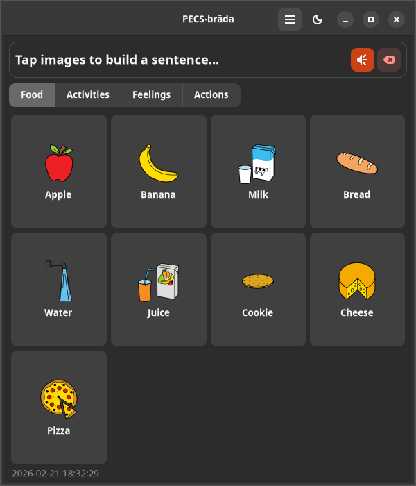

# 💬 PECS-bräda


## Screenshots

| English | Svenska |
|---------|---------|
|  |  |

**Digital PECS communication board with text-to-speech**

Part of the [Autismappar](https://www.autismappar.se) suite — free, open-source tools for communication and daily structure for children with autism and language disorders.


## Features

- 🎉 **Welcome dialog** — guided first-launch experience
- ⚙️ **Preferences** — theme (light/dark/system), icon size, cache management
- 📤 **Export/Print** — CSV, JSON and PDF export (Ctrl+E), tagged with app name, version and author
- 🇸🇪 **Swedish ARASAAC search** — 13,000+ pictogram keywords, works completely offline
- 🌍 **Translated** — full Swedish translation via [Transifex](https://app.transifex.com/danielnylander/pecsbrada)
- ⌨️ **Keyboard shortcuts** — Ctrl+E (export), Ctrl+, (preferences), F1 (about), Ctrl+/ (shortcuts)
- 🖼️ **ARASAAC pictograms** — Creative Commons licensed pictograms from [arasaac.org](https://arasaac.org)

## Install

### Debian/Ubuntu

```bash
# Add repository
curl -fsSL https://yeager.github.io/debian-repo/gpg.key | sudo gpg --dearmor -o /usr/share/keyrings/danne-l10n-suite.gpg
echo "deb [signed-by=/usr/share/keyrings/danne-l10n-suite.gpg] https://yeager.github.io/debian-repo stable main" | sudo tee /etc/apt/sources.list.d/danne-l10n-suite.list
sudo apt update && sudo apt install pecsbrada
```

### Fedora/RHEL

```bash
sudo dnf config-manager --add-repo https://yeager.github.io/rpm-repo/packages/
sudo dnf install pecsbrada
```

### From source

```bash
git clone https://github.com/yeager/pecsbrada.git
cd pecsbrada
pip install .
pecsbrada
```

## Dependencies

- Python 3.10+
- GTK 4
- libadwaita 1.4+
- espeak-ng (optional, for text-to-speech)

## Translation

Translate PECS-bräda on [Transifex](https://app.transifex.com/danielnylander/pecsbrada).

Source strings are in English. Swedish translation by Daniel Nylander.

## ARASAAC

Pictograms by Sergio Palao, from [ARASAAC](https://arasaac.org), licensed under [CC BY-NC-SA 4.0](https://creativecommons.org/licenses/by-nc-sa/4.0/) by the Government of Aragon.

Swedish ARASAAC keywords (15,607 entries) translated by Daniel Nylander.

## License

GPL-3.0-or-later

## Author

**Daniel Nylander** — [daniel@danielnylander.se](mailto:daniel@danielnylander.se)

- 🌐 [autismappar.se](https://www.autismappar.se)
- 💻 [github.com/yeager](https://github.com/yeager)
- 🌍 [Transifex](https://app.transifex.com/danielnylander)
